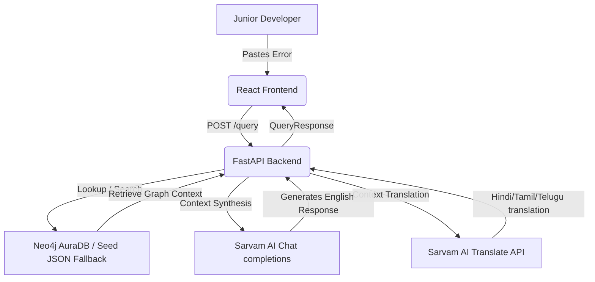

# 🎓 Understudy

> **AI pair-debugger for junior developers with institutional memory.** 
> When a new bug comes in, Understudy surfaces *"your team hit something like this before, here's the fix, here's who to ask"* instead of a second-hand search engine response.

---

## 💡 The Problem
In modern engineering teams, junior developers spend hours debugging errors that senior developers have already resolved. The context and solutions to these bugs are buried deep inside closed Pull Requests, forgotten Slack threads, and legacy issues. This leads to **wasted time, repeated mistakes, and high developer friction.**

## 🚀 The Solution: Understudy
**Understudy** acts as an internal developer "brain." When a developer inputs an error:
1. It searches the team's historical bugs using a **Neo4j graph database** to find similar incident signatures, files, and root causes.
2. It uses **Sarvam AI** to summarize the incident into a friendly, senior-dev-style response.
3. It provides the **exact lines of code affected, the fix code-snippet, and the PR reference link**.
4. It tells the junior dev **exactly who solved it** so they can reach out to them directly.
5. It offers **high-fidelity translation** into regional Indian languages (Hindi, Tamil, Telugu) while preserving technical code terms.

---

## 🛠️ Sponsor Track Integrations

### 1. 🗄️ Neo4j AuraDB (Graph Database)
Instead of a simple flat database, we model bugs as a connected graph of nodes: `Incident`, `ErrorSignature`, `RootCause`, `File`, `FixPattern`, `Person`, and `PR`. This allows us to traverse relationships (e.g., finding who reviewed the PR that fixed a similar error in the same file).
*   **Fallback mode:** If Neo4j is not configured, the app uses a smart local JSON/runtime memory fallback, making it fully runnable out-of-the-box.

### 2. 🤖 Sarvam AI (Extraction, Answer Synthesis, Multilingual)
*   **Structured Extraction (`sarvam-m`):** Converts raw, noisy stack traces pasted by developers into structured JSON objects matching our graph schema.
*   **Answer Generation:** Analyzes matched incidents and outputs a conversational explanation written in a supportive senior developer's voice.
*   **Code-Preserving Translation:** Translates explanations into **Hindi, Tamil, or Telugu** while using a custom masking regex to keep code tokens, variables (e.g. `items.map()`), and filenames (e.g. `Dashboard.jsx:24`) in English.

### 3. ☁️ Render Workflows (Ingestion Job)
*   Implements a background pipeline (`ingestion/ingest_job.py`) designed to run as a Render cron or workflow. It reads codebases or alerts, calls Sarvam AI for structure extraction, and writes nodes directly to our Neo4j graph database.

---

## 📐 System Architecture



---

## ✨ Features
*   💬 **Semantic Error Matching:** Calculates confidence matches between pasted tracebacks and team incident logs.
*   📝 **Dynamic Ingestion Portal:** Ingest a raw stack trace, let the AI structure it, and immediately watch it become queryable in real-time.
*   🌐 **Multilingual Selector:** Seamlessly switch between English, Hindi, Tamil, and Telugu. Technical terms and code snippets are automatically preserved in English for readability.
*   🎨 **Sleek Dark Theme:** A premium developer-centric dashboard designed with curated HSL color schemes and responsive layouts.

---

## 🚀 Quick Start & Installation

### 1. Configure Environment Variables
Copy `.env.example` to `.env` at the root of the project:
```bash
cp .env.example .env
```
Open `.env` and fill in your keys:
```env
SARVAM_API_KEY=your-sarvam-api-key
NEO4J_URI=neo4j+s://xxxxxxxx.databases.neo4j.io
NEO4J_USER=neo4j
NEO4J_PASSWORD=your-neo4j-password
VITE_API_URL=http://localhost:8000
```
*(Note: If you do not have Neo4j credentials, the app will run cleanly in local fallback mode using `backend/seed_data/incidents.json`.)*

### 2. Setup the Backend
Navigate to `backend`, activate the environment, and install dependencies:
```bash
cd backend
python -m venv .venv

# Activate Virtual Env (Windows PowerShell):
.\.venv\Scripts\Activate.ps1
# Activate Virtual Env (macOS/Linux):
source .venv/bin/activate

# Install Backend & AI dependencies:
pip install -r requirements.txt
pip install -r ../ai/requirements.txt

# Start the FastAPI Server:
uvicorn app.main:app --reload --port 8000
```

### 3. Setup the Frontend
Open a new terminal window, navigate to `frontend`, and start the Vite dev server:
```bash
cd frontend
npm install
npm run dev
```
Open your browser and navigate to `http://localhost:5173/`.

---

